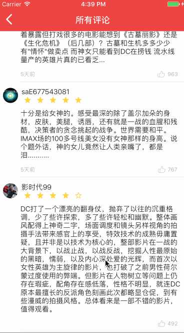

# MovieEye——模仿猫眼电影APP的ios电影客户端

仅供学习使用，并无商业用途

>本demo使用的框架有以下

```
'QMUIKit',
'AFNetworking',
'MJExtension',
'Masonry',
'UITableView+FDTemplateLayoutCell',
'DateTools',
'MJRefresh',
'LazyScroll',
'YTKNetwork'
```
## Usage 使用方法

```sh
git clone https://github.com/RanYeee/MovieEye.git 

pod update
```

## 运行截图


>GIF演示

所有评论


电影详情


>ps:再次声明，本demo仅限学习，并无商业用途且勿用于商业用途。


欢迎关注我的简书：[Rany_Xu](http://www.jianshu.com/u/c45291e63883)
个人博客：[Ranyeee.top](http://ranyeee.top)


